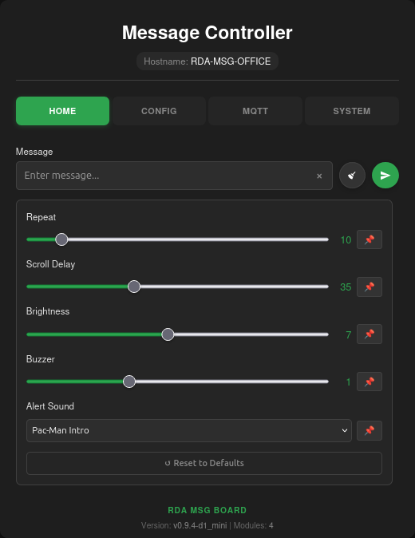
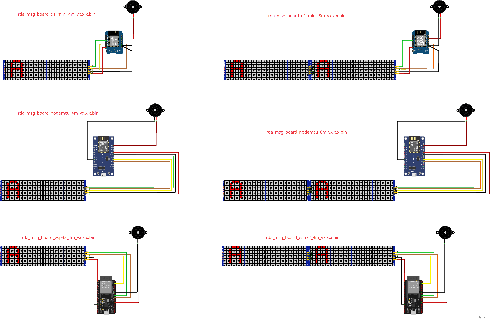
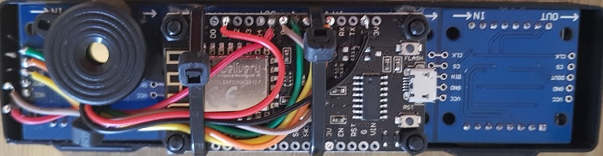
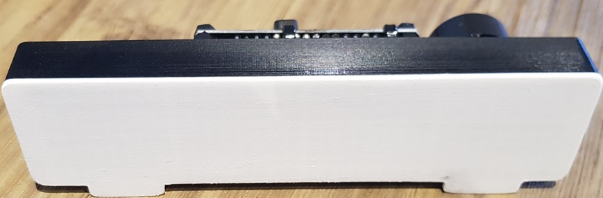
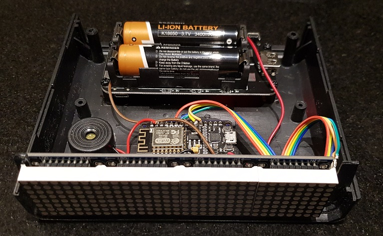
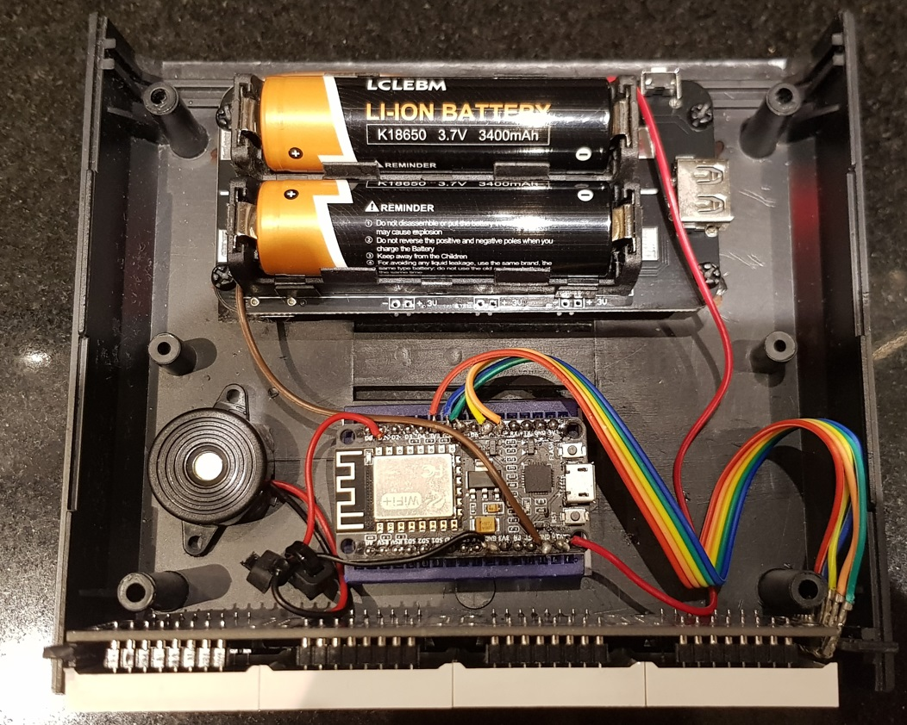
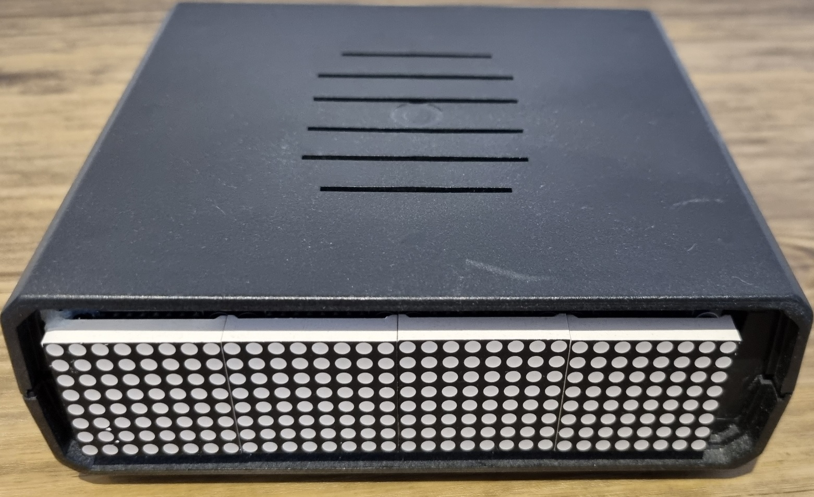

# RDA MSG Board

A WiFi-enabled LED matrix message board system for ESP8266 and ESP32 microcontrollers that displays scrolling messages from remote systems or users via HTTP, MQTT, or a built-in web interface. Designed for home automation integration with Home Assistant, NodeRed, Linux/Windows systems, and direct browser access.

## Overview

This project transforms an ESP8266 or ESP32 board paired with MAX7219 LED matrix display modules into a versatile, network-connected message board. It provides multiple methods for sending messages: a web-based GUI, HTTP REST API (URL-encoded or JSON), and MQTT messaging with flexible topic subscriptions. The system features persistent configuration storage, OTA firmware updates, UTF-8 character support, and customizable display parameters including scroll speed, brightness, repeat count, and audible alerts.

Originally developed for Aduino IDE at [esp8266_max7219_rda_msg_board](https://github.com/rdeangel/esp8266_max7219_rda_msg_board), this project has been completely refactored to use PlatformIO (with vscode) for better dependency management, multi-environment support, and improved development workflow. The UI has been updated to a more modern look and feel, and the codebase has been significantly cleaned up and optimized.

<p align="center">
  
</p>

> [!NOTE]
> For a full visual tour of all the settings and configuration pages available in the web interface, please see the **[UI Overview Guide](docs/UI_OVERVIEW.md)**.

## Key Features

### Communication & Control
- **Web Interface** - Full-featured GUI for message control and configuration
  - Responsive design with AJAX data updates (XML responses)
  - HTTP Basic Authentication and in-page confirmation modals
- **HTTP REST API** - Send messages via GET (URL-encoded) or POST (JSON) requests
- **MQTT Integration** - Flexible topic subscriptions with wildcard support, anonymous or authenticated modes
- **Secure MQTT (TLS/SSL)** - Full TLS encryption support with fingerprint or CA certificate validation (ESP32 only)
- **Home Assistant Discovery** - Automatic device detection and configuration (Zero-config setup)
- **mDNS Support** - Access via hostname (e.g., `RDA-MSG-ABCDEF.local`) instead of IP address

### Message & Display Control  
- **UTF-8 Extended ASCII** - Display international characters and symbols (see character list below)
- **Configurable Parameters** - Control repeat count, scroll speed, brightness, and buzzer alerts
- **Persistent Defaults** - Save custom default values for message parameters via web interface
- **Global Buzzer Control** - Master toggle to enable or disable all audible notifications globally
- **Advanced Clock Display** - Highly configurable LED clock with transition effects and date support
- **POSIX Timezone Support** - Accurate timekeeping using standard POSIX timezone strings
- **Sleep Mode** - Scheduled display power-saving/dark (blackout) with specific weekday and weekend time windows
- **Chirp Library** - Pre-defined musical alerts (fansfare, alarms, chimes, For Elise, Mario Bros) for timer events
- **Real-time Updates** - Messages display immediately across all input methods
- **Timer & Stopwatch** - Count down or count up with buzzer alerts and auto-repeat

### Configuration & Management
- **WiFi Configuration Portal** - Easy setup via captive portal on first boot or after reset
- **LittleFS Storage** - Persistent configuration for credentials, MQTT settings, and defaults
- **OTA Firmware Updates** - Update firmware directly through web interface
- **Config Export/Import** - Backup and restore complete device configuration as JSON
- **Factory Reset** - Reset all settings via web interface or optional physical button
- **Custom Hostname** - Change device hostname from default `RDA-MSG-XXXXXX`

## Hardware

- **Microcontroller**:
  - **ESP8266**: NodeMCU 1.0, WeMos D1 Mini, or compatible
  - **ESP32**: ESP32 DevKit v1, or compatible
- **LED Display**: MAX7219 LED Matrix modules (Supports 4, 8, 12+ modules)
  - *Note: Pre-built binaries are provided for **4 and 8 module** configurations for both platforms.*
- **Buzzer**: Optional piezo buzzer for audible notifications ([example here](https://www.amazon.co.uk/dp/B09RG8H7Q7)
QWORK® 8 Pcs Electronic buzzer , 3-24V piezoelectric buzzer 87dB , for physical circuits continuous sound electronic buzzer alarm , cable length 100mm)
- **Power Supply**: 5V DC (USB or external). Multiple modules require a high-current power source.

## Pin Configuration

Default pin assignments are platform-specific (configurable in `include/config.h` or via build flags):

### ESP8266 Pin Assignments (NodeMCU / D1 Mini)

| Function | NodeMCU | D1 Mini | GPIO | Description |
| :--- | :--- | :--- | :--- | :--- |
| **CLK** | D5 | D5 | 14 | SPI Clock |
| **DIN** | D7 | D7 | 13 | SPI MOSI |
| **CS** | D8 | D4 | 15 / 2 | Chip Select |
| **Buzzer** | D1 | D1 | 5 | Optional Alert |

### ESP32 Pin Assignments

| Function | Pin | Description |
| :--- | :--- | :--- |
| **CLK** | GPIO 18 | VSPI CLK |
| **DIN** | GPIO 23 | VSPI MOSI |
| **CS** | GPIO 5 | VSPI CS |
| **Buzzer** | GPIO 4 | Optional Alert |

**Wiring Diagrams:**



> [!NOTE]
> For ESP32, connect MAX7219 DIN to GPIO 23, CLK to GPIO 18, and CS to GPIO 5. The project uses the ESP32's standard VSPI hardware interface for optimal performance.


## Configuration

### Module Count

The number of LED modules is configured via PlatformIO build environments in `platformio.ini`:

**For GitHub releases** (automated builds):
- **ESP8266**:
  - `esp8266_4m` - 4 modules
  - `esp8266_8m` - 8 modules
- **ESP32**:
  - `esp32_4m` - 4 modules
  - `esp32_8m` - 8 modules

To build for a different module count locally, add `-DMAX_DEVICES=8` to your environment's `build_flags` in `platformio.ini`:

```ini
[env:d1_mini]
board = d1_mini
build_flags =
    ${env.build_flags}
    -DMAX_DEVICES=8  # Change to 4, 8, 12, etc.
```

### Modular Features (Enable/Disable)

Certain features of the message board can be configured at compile time to save memory and flash space. This is especially useful for ESP8266 boards, which have limited heap constraints.

In `platformio.ini`, you can uncomment any of the following definitions under your target environment's `build_flags` to disable specific functionality:

```ini
    ; --- Modular Features ---
    ; -DDISABLE_SLEEP_MODE_FEATURE
    ; -DDISABLE_TIMER_FEATURE
    -DDISABLE_WEATHER_FEATURE
    ; -DDISABLE_ALARM_FEATURE
```

> [!NOTE]
```markdown
> **Important Note for ESP8266 Users:** Enabling the Weather feature on ESP8266 will make WiFi setup (Captive Portal) unreliable; you will likely not be able to scan for or enter the WiFi SSID. For this reason, it is disabled by default (`-DDISABLE_WEATHER_FEATURE`). You can upload firmware with Weather enabled *after* WiFi is configured and it will work fine, but if you need to reset the device, you may need to flash a version without the Weather feature first or you might struggle.
```

### Version Management

The firmware version is centrally managed in `platformio.ini` using [Semantic Versioning](https://semver.org/):

```ini
[common]
project_name = rda_msg_board
version = v1.0.0  # Update here for new releases
```

All build environments automatically use this version. To create a new release, update the version here and use the release script (see Release Management section).

## Getting Started

### Prerequisites

1. Install [Visual Studio Code](https://code.visualstudio.com/)
2. Install the [PlatformIO IDE extension](https://platformio.org/install/ide?install=vscode)

### Building and Uploading

1. **Open Project** - Open this folder in VS Code
2. **Install Dependencies** - PlatformIO will automatically install required libraries on first build
3. **Select Environment** - Choose your target board:
   - **ESP8266**:
     - `nodemcu_4m` / `nodemcu_8m` - NodeMCU CI/Release builds (4 and 8 module variants)
     - `d1_mini_4m` / `d1_mini_8m` - D1 Mini CI/Release builds (4 and 8 module variants)
   - **ESP32**:
     - `esp32_4m` / `esp32_8m` - ESP32 CI/Release builds (4 and 8 module variants)
4. **Build** - Click the checkmark icon in PlatformIO toolbar, or use the `/test_build` workflow
5. **Upload** - Click the arrow icon in PlatformIO toolbar

**Quick Build Command:**
```bash
# Using the /test_build workflow (recommended)
# Or manually:
platformio run --target upload --environment d1_mini
```
```

### Release Management

Use the provided release scripts to automate version tagging and GitHub releases:

**Bash (Linux/Mac/Git Bash):**
```bash
./release.sh "Your release notes"
./release.sh --force  # Recreate existing tag
```

The script will:
1. Extract version from `platformio.ini`
2. Create a git tag (e.g., `v1.0.1`)
3. Push to GitHub
4. Trigger automated builds for both ESP8266 and ESP32 (4m and 8m configurations)
5. Create a GitHub Release with downloadable firmware binaries for both platforms

### Project Structure

```text
├── .github/ workflows/      # Automated build & release CI
├── docs/                   # Detailed documentation
│   ├── env_board_variants/ # Hardware wiring diagrams (SVG/PNG)
│   ├── ARCHITECTURE.md     # System design & logic flow
│   ├── HARDWARE_REF.md     # Pinouts & wiring guides
│   ├── HOME_ASSISTANT.md   # Discovery & entity mapping
│   ├── HTTP_API.md         # REST endpoint documentation
│   └── MQTT_EXAMPLES.md    # Topic patterns & payloads
├── include/                # Header files (*.h)
├── src/                    # Source files (*.cpp)
│   ├── main.cpp            # Setup/Loop entry point
│   ├── config_manager.cpp  # LittleFS JSON persistence
│   ├── web_server.cpp      # HTTP Routing & Auth
│   ├── web_pages_*.cpp     # Embedded HTML/CSS/JS assets
│   ├── mqtt.cpp            # PubSubClient logic
│   ├── mqtt_discovery_*.cpp# Grouped HA Discovery modules
│   ├── buzzer_utils.cpp    # Chirp & alarm logic
│   ├── weather.cpp         # OpenWeather API integration
│   └── functions.cpp       # Core display & UTF-8 logic
├── node_red_flow.json      # NodeRed integration example
├── platformio.ini          # PIO environments & dependencies
├── release.sh / .ps1       # Cross-platform release scripts
└── images/                 # GUI & case screenshots
```

### Libraries Used

All dependencies are automatically managed by PlatformIO and are compatible with both ESP8266 and ESP32:

- **MD_MAX72XX** (^3.5.1) - LED matrix control
- **MD_Parola** (^3.7.5) - Scrolling text effects
- **WiFiManager** (^2.0.17) - WiFi configuration portal (multi-platform)
- **EasyButton** (^2.0.3) - Button handling (ESP8266 only, ignored on ESP32)
- **ArduinoJson** (^7.4.2) - JSON parsing and serialization
- **PubSubClient** (^2.8) - MQTT client

> [!NOTE]
> The EasyButton library is explicitly excluded from ESP32 builds via `lib_ignore` in `platformio.ini` as the persistent flash button feature is optional and defaults to ESP8266-only. This does not affect core message functionality.

## Initial Setup

### WiFi Setup Mode

On first boot or after a factory reset, the device creates a WiFi access point for configuration:

1. **Connect to AP**:
   - **SSID**: `RDA-MSG-XXXXXX` (where XXXXXX is a unique device identifier)
     - *ESP8266: Last 6 hex digits of chip ID*
     - *ESP32: Derived from MAC address*
   - **Password**: `wifi-setup`

2. **Configure WiFi**:
   - Most modern devices will automatically open the captive portal
   - If not, manually browse to: `http://192.168.4.1`
   - Click **"Configure WiFi"**
   - Enter your WiFi network SSID and password
   - Click **"Save"**

3. **Connect to Network**:
   - The device will reboot and connect to your WiFi network
   - Look for the assigned IP address displayed on the LED matrix after boot
   - Optionally, assign a static IP via your router's DHCP settings for consistent access

> [!TIP]
> You can also access the device using its mDNS hostname: `http://RDA-MSG-XXXXXX.local` (replace XXXXXX with your device ID)

### Default Credentials

**Web Interface Login:**
- **Username**: `admin`
- **Password**: `msgboard`

> [!IMPORTANT]
> Change the default credentials immediately after first setup via the **Device Config** page in the web interface.

## Web Interface

Access the web interface at the device's IP address or mDNS hostname (e.g., `http://192.168.1.100` or `http://RDA-MSG-ABCDEF.local`).

### Main Pages

**Homepage** - Send messages and control display parameters:
- Message text input
- Repeat count (how many times to scroll)
- Buzzer chirps (audible notifications)
- Scroll delay (speed)
- Brightness (0-15)
- Set and save custom defaults

**General Settings** - Global device parameters:
- Global Buzzer Toggle (Master switch for all beeps)
- Global Brightness Override

**Device Config** - Change credentials and hostname:
- Web interface username/password
- Custom device hostname
- Config export/import for backup/restore

**MQTT Config** - Configure MQTT integration:
- Enable/disable MQTT
- MQTT server address and port
- Authentication (anonymous or user/password)
- MQTT TLS (ESP32 only)
- Topic prefix configuration
- Connection/disconnection alerts
- Incoming message display toggle

**Clock & Display** - Configure clock functionality:
- Set Timezone Offset and 12/24 hour format
- Configure Time animations and display length
- Clock brightness control

**Timer Settings** - Configure countdown timer or stopwatch mode:
- Duration and Alert sound configuration

**Weather Settings** (ESP32 Only, disabled on ESP8266 by default) - Configure weather display:
- OpenWeatherMap API key integration
- City/Location configuration
- Units (Metric/Imperial)

**Sleep Mode** - Configure schedule:
- Scheduled display dimming or blackout windows
- Start/End time configuration
- Optional Weekend Mode

**System** - System management:
- OTA firmware upload
- Device reboot (resets the board)
- Factory reset (wipe all configuration)
- Current version display

### Example Case Builds

**Example 1 - Compact Design:**




**Example 2 - Portable (battery and main powered) Setup:**





## HTTP API

The device provides two HTTP endpoints for sending messages programmatically.
For a comprehensive testing guide and more examples, see **[HTTP API Examples](docs/HTTP_API_EXAMPLES.md)**.

### URL Arguments Endpoint (`/arg`)

Send messages via GET request with URL-encoded parameters.

**Endpoint**: `GET /arg`  
**Authentication**: HTTP Basic Auth (username:password)

**Parameters:**

| Parameter | Description | Default | Range/Values |
|-----------|-------------|---------|--------------|
| `MSG` | Message text to display | *(required)* | UTF-8 string |
| `REP` | Repeat count (scroll cycles) | 10 | 0 = infinite |
| `BUZ` | Buzzer chirps | 10 | 0 = silent |
| `DEL` | Scroll delay (ms per step) | 35 | Lower = faster |
| `BRI` | Brightness level | 7 | 0 (dim) - 15 (bright) |
| `ASC` | UTF-8 ASCII conversion | 1 | 0 = off, 1 = on |
| `ALERTCHIRP` | Alert chirp pattern | Fast Beep | See chirp library below |

> [!NOTE]
> Omitting the `MSG` parameter or sending with empty value will stop the current message scrolling.

**Available Chirp Patterns:**
Silent, Fast Beep, Simple Beep, Gentle Dawn, Cheerful, Urgent, Beep, Quick Tap, Double, Triple, Doorbell, Alarm, Victory, Notify, For Elise, Mario Bros, Imperial March, Nokia Ringtone, Star Wars Theme, Tetris, Pac-Man, Simpsons, Underworld, Indiana Jones, Pink Panther, Game Over, Level Up, Achievement, 24 CTU Ring

**Example - Send Message:**
```bash
curl --user admin:msgboard -X GET -G 'http://192.168.1.100/arg' \
  --data-urlencode "MSG=Hello World!" \
  --data-urlencode "REP=5" \
  --data-urlencode "BUZ=3" \
  --data-urlencode "DEL=30" \
  --data-urlencode "BRI=10" \
  --data-urlencode "ASC=1" \
  --data-urlencode "ALERTCHIRP=Gentle Dawn"
```

**Example - URL Encoded (for browsers):**
```
http://192.168.1.100/arg?MSG=This+is+a+test+message%21&REP=10&BUZ=10&DEL=35&BRI=7&ASC=1&ALERTCHIRP=Gentle+Dawn
```

Use [URL encoder/decoder](https://meyerweb.com/eric/tools/dencoder/) for special characters.

**Example - Stop Current Message:**
```bash
curl --user admin:msgboard -X GET 'http://192.168.1.100/arg'
```

### JSON API Endpoint (`/api`)

Send messages via POST request with JSON payload.

**Endpoint**: `POST /api`  
**Authentication**: HTTP Basic Auth (username:password)  
**Content-Type**: `application/json`

**JSON Fields** (all optional except MSG for new messages):

```json
{
  "MSG": "Message text",
  "REP": 10,
  "BUZ": 10, 
  "DEL": 35,
  "BRI": 7,
  "ASC": 1,
  "ALERTCHIRP": "Gentle Dawn"
}
```

**Example - Send Message:**
```bash
curl --user admin:msgboard -X POST http://192.168.1.100/api \
  -H 'Content-Type: application/json' \
  -d '{"MSG":"This is a test message","REP":1,"BUZ":10,"DEL":2,"BRI":0,"ASC":1}'
```

**Example - Minimal (uses defaults):**
```bash
curl --user admin:msgboard -X POST http://192.168.1.100/api \
  -H 'Content-Type: application/json' \
  -d '{"MSG":"Quick message"}'
```

**Example - Stop Current Message:**
```bash
curl --user admin:msgboard -X POST http://192.168.1.100/api \
  -H 'Content-Type: application/json' \
  -d '{"MSG":""}'
```

### Configuration Management Endpoints

**Export Configuration** (`GET /exportconfig`):
```bash
curl --user admin:msgboard http://192.168.1.100/exportconfig > config_backup.json
```

Returns complete device configuration including credentials, MQTT settings, defaults, and WiFi credentials.

**Import Configuration** (`POST /importconfig`):
```bash
curl --user admin:msgboard -X POST http://192.168.1.100/importconfig \
  -H 'Content-Type: application/json' \
  -d @config_backup.json
```

Restores configuration from backup file. Device will apply settings immediately.

## MQTT Integration

The message board supports MQTT with flexible topic subscription patterns, making it easy to integrate with home automation systems.
For a comprehensive guide on MQTT commands and clock control, see **[MQTT Examples](docs/MQTT_EXAMPLES.md)**.

### MQTT Configuration

Configure via web interface (`/mqttconfig`) or imported configuration:

- **MQTT Server**: IP address or hostname
- **MQTT Port**: Default 1883 (Plain) or 8883 (TLS)
- **Authentication**: Anonymous or username/password
- **TLS/SSL**: Enable encryption, validate via Fingerprint or CA Certificate (ESP32 only)
- **Topic Prefix**: Root topic for subscriptions (supports wildcards)
- **Alerts**: Enable/disable connection/disconnection notifications on display

### Topic Subscription Pattern

When you configure a topic prefix like `rdadotmatrix/generic`, the device automatically subscribes to:

```
rdadotmatrix                     # Root topic - plain messages
rdadotmatrix/json                # Root topic - JSON messages
rdadotmatrix/generic             # Configured prefix - plain messages
rdadotmatrix/generic/json        # Configured prefix - JSON messages
RDA-MSG-ABCDEF                   # Device-specific - plain messages
RDA-MSG-ABCDEF/json              # Device-specific - JSON messages
```

### Wildcard Support

**Hash (`#`) Wildcard** - Subscribe to all subtopics:
```
Topic Prefix: rdadotmatrix/generic/#
```
Subscribes to:
```
rdadotmatrix                     # Root still subscribed
rdadotmatrix/json
rdadotmatrix/generic/#           # All subtopics under generic/
RDA-MSG-ABCDEF
RDA-MSG-ABCDEF/json
```

Messages can be published to:
- `rdadotmatrix/generic/room1/json`
- `rdadotmatrix/generic/room2/alerts/json`
- Any path under `rdadotmatrix/generic/`

**Plus (`+`) Wildcard** - Single-level wildcard in topic path.

### Message Formats

**Plain Text Messages** (topics NOT ending in `/json`):
```bash
mosquitto_pub -h 192.168.1.100 -t "rdadotmatrix/generic" -m "Hello from MQTT"
```
Uses default parameters (REP=10, BUZ=10, DEL=35, BRI=7, ASC=1).

**JSON Messages** (topics ending in `/json`):
```bash
mosquitto_pub -h 192.168.1.100 -t "rdadotmatrix/generic/json" \
  -m '{"MSG":"Custom message","REP":5,"BUZ":3,"DEL":25,"BRI":10,"ASC":1}'
```

**Minimal JSON** (omitted parameters use defaults):
```bash
mosquitto_pub -h 192.168.1.100 -t "RDA-MSG-ABCDEF/json" \
  -m '{"MSG":"Quick alert"}'
```

**Stop Message**:
```bash
mosquitto_pub -h 192.168.1.100 -t "rdadotmatrix/generic/json" \
  -m '{"MSG":""}'
```

### Connection Status

The device publishes its connection status to:
```
RDA-MSG-ABCDEF/status: "Connected"
```

## Home Assistant Integration (Automatic)
**Recommended Method**

This firmware supports **Home Assistant MQTT Discovery**. When enabled, the device will automatically appear in Home Assistant with all controls and sensors.

For detailed setup instructions and a list of available entities, see the **[Home Assistant Integration Guide](docs/HOME_ASSISTANT_INTEGRATION.md)**.

## Home Assistant Integration (Manual / REST)

> [!CAUTION]
> This is a **legacy method** using manual YAML configuration. It is recommended to use the [Automatic Integration](docs/HOME_ASSISTANT_INTEGRATION.md) instead.

If you prefer to manually configure your dashboard, scripts, and automations using YAML, or if you need to integrate via the REST API, please refer to the:

**[Manual / Legacy Home Assistant Integration Guide](docs/HOME_ASSISTANT_LEGACY.md)**

This guide includes:
- Base64 Authentication setup
- Manual Dashboard (Lovelace) configuration
- REST Commands and Scripts
- RSS Feed automations


## NodeRed Integration

Import the provided `node_red_flow.json` file for a complete NodeRed integration example.

### Required NPM Packages

Install these packages in NodeRed:
```
node-red-contrib-simple-message-queue
node-red-node-feedparser
```

### Features Included

The NodeRed flow includes:
- MQTT message publishing subflows
- RSS feed processing with character escaping (handles backslashes, quotes, etc.)
- Message queue management
- Examples for both plain and JSON MQTT messages

> [!TIP]
> The flow includes special character escaping functions useful when working with RSS feeds that may contain quotes, backslashes, or other characters that could break message display.

## UTF-8 Extended ASCII Characters

The device supports UTF-8 extended ASCII characters for international and special character display.

### Supported Characters

```
!"$'()*,-./0123456789:<=>?@ABCDEFGHIJKLMNOPQRSTUVWXYZ[\]^_`abcdefghijklmnopqrstuvwxyz{|}~¡¢£€¤¥¦§¨©ª«¬­®¯°±²³´µ¶·¸¹º»¼½¾¿ÀÁÂÃÄÅÆÇÈÉÊËÌÍÎÏÐÑÒÓÔÕÖ×ØÙÚÛÜÝÞßàáâãäåæçèéêëìíîïðñòóôõö÷øùúûüýþÿ
```

### Special Handling Characters

These characters require special encoding in URLs or may need escaping in certain contexts:
```
# % & + ;
```

> [!NOTE]
> In NodeRed, the provided flow includes escape functions for handling special characters like backslashes and double-quotes in RSS feeds.

Reference: [UTF-8 Character Table](https://www.utf8-chartable.de/)

## Factory Reset

Reset the device to default settings and clear all configuration.

### Method 1: Web Interface

1. Navigate to `/system`
2. Click **"Wipe Config"**
3. Confirm the action
4. Device will:
   - Clear WiFi configuration
   - Reset web credentials to `admin`/`msgboard`
   - Clear MQTT configuration
   - Clear custom defaults
   - Reboot into WiFi Setup Mode

### Method 2: Physical Button (Optional)

If `ENABLE_FLASH_BUTTON` is enabled in `include/config.h` (currently disabled by default):
- Press the FLASH button (GPIO0)
- Device will perform factory reset and reboot
- *Note: Currently only supported on ESP8266*

### Method 3: URL

Browse to:
```
http://192.168.1.100/factoryreset
```

## Troubleshooting

### Cannot Connect to WiFi Setup Portal

- **Check SSID**: Look for `RDA-MSG-XXXXXX` in WiFi networks (X = last 6 chars of MAC)
- **Password**: Ensure you're using `wifi-setup` (case-sensitive)
- **Manual IP**: If portal doesn't open automatically, browse to `http://192.168.4.1`
- **Factory Reset**: Hold FLASH button or upload firmware with cleared WiFi settings

### Cannot Access Web Interface

- **Check IP**: Verify IP address shown on LED matrix after boot
- **Try mDNS**: Use `http://RDA-MSG-XXXXXX.local` instead of IP
- **Credentials**: Default is `admin`/`msgboard`, check if changed
- **Network**: Ensure device and computer are on same network/VLAN

### MQTT Not Connecting

- **Check Config**: Verify server address, port, and credentials in `/mqttconfig`
- **Enable MQTT**: Ensure "MQTT On/Off" is set to "on"
- **Topic Prefix**: Verify topic prefix doesn't have syntax errors
- **Alerts**: Enable connection alerts to see status on display
- **Server**: Confirm MQTT broker is running and accessible

### Messages Not Displaying

- **Parameter Check**: Ensure `MSG` parameter is not empty
- **Repeat Count**: If REP=0, message scrolls indefinitely; use empty MSG to stop
- **Brightness**: Check BRI value isn't set to 0 (completely dim but still visible)
- **Character Support**: Some characters may not display if UTF-8 conversion (ASC=0)

### Firmware Upload Issues

- **Serial Monitor**: Close serial monitor before uploading
- **USB Driver**: Install CH340/CP2102 drivers for your board
- **Port Selection**: Verify correct COM port selected in PlatformIO
- **Erase Flash**: If persistent issues, erase flash and re-upload

### Display Shows Garbled Text

- **UTF-8 Conversion**: Ensure ASC parameter is set to 1 for international characters
- **Escape Issues**: Check for unescaped special characters in message text
- **Buffer Overflow**: Very long messages may cause issues; keep messages reasonable

## Configuration Files

The device stores configuration in LittleFS flash filesystem:

- `/web_config.json` - Web credentials and hostname
- `/mqtt_config.json` - MQTT settings
- `/defaults_config.json` - Custom message parameter defaults
- `/general.config` - General device parameters (e.g. buzzer toggles, overrides)
- `/clock.config` - Clock and timezone settings
- `/timer.config` - Timer and stopwatch settings
- `/weather.config` - OpenWeatherMap integration settings
- `/sleep_mode.config` - Sleep schedule configurations
- `/alarm.config` - Schedule recurring daily alarms
- `/recurrent_alarm.config` - Fixed interval alerts (Home Assistant discovery is ESP32-only)

These are automatically created on first boot. While stored as individual files in flash memory, they are aggregated and downloaded as a single comprehensive JSON backup file when you use the Export feature on the Device Config page. This single file can later be imported to restore all settings at once.

## Version Information

Current firmware version is defined in `platformio.ini` and displayed on the web interface. Build artifacts are automatically generated for the following CI environments:
- **NodeMCU (ESP8266)**: `rda_msg_board_nodemcu_4m_v0.9.4.bin` / `rda_msg_board_nodemcu_8m_v0.9.4.bin`
- **Wemos D1 Mini (ESP8266)**: `rda_msg_board_d1_mini_4m_v0.9.4.bin` / `rda_msg_board_d1_mini_8m_v0.9.4.bin`
- **ESP32 DevKit**: `rda_msg_board_esp32_4m_v0.9.4.bin` / `rda_msg_board_esp32_8m_v0.9.4.bin`

## License

This project is licensed under the MIT License - see the [LICENSE](LICENSE) file for details.

## Credits

- Original project development for Arduino IDE
- Migrated to PlatformIO for improved development workflow
- Uses MD_Parola library for scrolling effects
- WiFiManager for easy WiFi configuration

## Documentation

Detailed documentation for specific features and integrations:

- **[Installation & Setup](docs/HARDWARE_REFERENCE.md)** - Hardware pinning and resource allocation
- **[Home Assistant Integration](docs/HOME_ASSISTANT_INTEGRATION.md)** - Guide for integrating with Home Assistant
- **[MQTT Examples](docs/MQTT_EXAMPLES.md)** - CLI and script examples for MQTT control
- **[HTTP API Examples](docs/HTTP_API_EXAMPLES.md)** - Comprehensive guide to the REST API
- **[MQTT TLS Implementation](docs/MQTT_TLS_IMPLEMENTATION.md)** - Technical details of SSL/TLS security on ESP32
- **[Architecture](docs/ARCHITECTURE.md)** - System architecture and module documentation

## Code Organization

The codebase is modularly organized for maintainability:

- **Web Layer**: `web_server`, `config_manager`, `web_data`, `web_pages_*` - HTTP interface and configuration
- **MQTT Layer**: `mqtt`, `mqtt_discovery_*` - MQTT client and Home Assistant integration
- **Core Logic**: `functions`, `utf8_utils`, `buzzer_utils` - Display control, character encoding, audio feedback
- **Configuration**: JSON files in LittleFS (`/web_config.json`, `/mqtt_config.json`, `/defaults_config.json`, `/general.config`)

See [`docs/ARCHITECTURE.md`](docs/ARCHITECTURE.md) for detailed module documentation.

## AI Agents & LLM Skill

This project includes an **RDA MSG Board** skill document that can be used by AI agents or LLMs (such as OpenClaw) to interact with and control the LED matrix display directly.

The skill provides Python scripts and instructions for sending scrolling text messages, playing audible alerts, and managing multiple board connection profiles.

- **SKILL For AI Agents / LLMs:** Configure your agent (e.g., OpenClaw) to load the skill from `skills/rda-msg-board/SKILL.md`. This provides the LLM with the ability to use the provided `send_message.py` and `manage_boards.py` scripts to send messages and alerts via the HTTP JSON API.
  ```bash
  python3 skills/rda-msg-board/scripts/manage_boards.py add office --ip 192.168.1.50 --user admin --pass msgboard
  python3 skills/rda-msg-board/scripts/send_message.py "Hello from AI Agent" --profile office
  ```
- **For Manual Use:** Users can read [`skills/rda-msg-board/SKILL.md`](skills/rda-msg-board/SKILL.md) directly as a comprehensive guide on how to set up device profiles and trigger messages manually from the terminal.
  ```bash
  python3 skills/rda-msg-board/scripts/send_message.py "Hello World" --ip 192.168.1.100
  ```

---

## Additional Resources

- [PlatformIO Documentation](https://docs.platformio.org/)
- [MD_Parola Library](https://github.com/MajicDesigns/MD_Parola)
- [WiFiManager Library](https://github.com/tzapu/WiFiManager)
- [Home Assistant MQTT Integration](https://www.home-assistant.io/integrations/mqtt/)
- [NodeRed Documentation](https://nodered.org/docs/)
