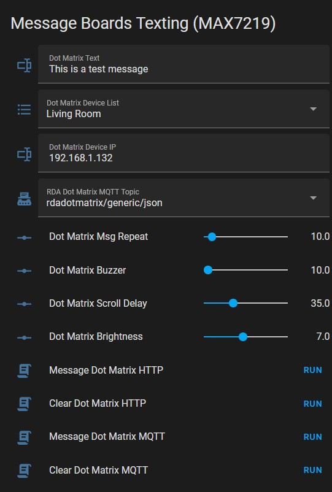

# Home Assistant Manual / Legacy Configuration

This guide covers the manual integration method for Home Assistant using YAML configuration (REST and MQTT). This is considered a **legacy method** and is replaced by the automatic [MQTT Discovery](HOME_ASSISTANT_INTEGRATION.md).

## Prerequisites

### Basic Authentication Setup

Home Assistant requires Base64-encoded credentials for HTTP requests.

Add to `secrets.yaml`:
```yaml
# For default credentials (admin:msgboard)
dot_matrix_secret_header: "Basic YWRtaW46ZXNwODI2Ng=="
```

To generate for custom credentials, encode `username:password` at [base64encode.org](http://n-cg.net/base64.htm).

## Dashboard Card



Create input helpers and scripts for a dashboard card:

**Lovelace Card Configuration:**
```yaml
type: entities
entities:
  - entity: input_text.dot_matrix_text
  - entity: input_select.dot_matrix_device_list
  - entity: input_text.dot_matrix_ip
  - entity: input_select.rda_dot_matrix_mqtt_topic
  - entity: input_number.dot_matrix_msg_repeat
  - entity: input_number.dot_matrix_buzzer
  - entity: input_number.dot_matrix_scroll_delay
  - entity: input_number.dot_matrix_brightness
  - entity: script.message_dot_matrix_http
  - entity: script.clear_dot_matrix_http
  - entity: script.message_dot_matrix_mqtt
  - entity: script.clear_dot_matrix_mqtt
title: Message Boards Texting (MAX7219)
```

## HTTP REST Commands

Add to `configuration.yaml`:

```yaml
rest_command:
  message_dot_matrix_arg_http:
    url: "http://{{ states('input_text.dot_matrix_ip') }}/api"
    method: POST
    headers:
      authorization: !secret dot_matrix_secret_header
      content-type: "application/json"
    payload: "{MSG:'{{ states('input_text.dot_matrix_text') }}',REP:{{ states('input_number.dot_matrix_msg_repeat') }},BUZ:{{ states('input_number.dot_matrix_buzzer') }},DEL:{{ states('input_number.dot_matrix_scroll_delay') }},BRI:{{ states('input_number.dot_matrix_brightness') }},ASC:1}"
    
  clear_dot_matrix_arg_http:
    url: "http://{{ states('input_text.dot_matrix_ip') }}/arg"
    method: GET
    headers:
      authorization: !secret dot_matrix_secret_header
```

## Scripts

### Send Message via HTTP:
```yaml
script:
  message_dot_matrix_http:
    sequence:
      - service: rest_command.message_dot_matrix_arg_http
        data: {}
    mode: single
    alias: Message Dot Matrix HTTP
```

### Clear Message via HTTP:
```yaml
script:
  clear_dot_matrix_http:
    sequence:
      - service: rest_command.clear_dot_matrix_arg_http
        data: {}
    mode: single
    alias: Clear Dot Matrix HTTP
```

### Send Message via MQTT:
```yaml
script:
  message_dot_matrix_mqtt:
    alias: Message Dot Matrix MQTT
    sequence:
      - service: mqtt.publish
        data:
          topic: '{{ states(''input_select.rda_dot_matrix_mqtt_topic'') }}'
          payload: |-
            { MSG: "{{ states('input_text.dot_matrix_text') }}",
              REP: "{{ states('input_number.dot_matrix_msg_repeat') }}",
              BUZ: "{{ states('input_number.dot_matrix_buzzer') }}", 
              DEL: "{{ states('input_number.dot_matrix_scroll_delay') }}",
              BRI: "{{ states('input_number.dot_matrix_brightness') }}",
              ASC: '1' 
            }
    mode: single
```

### Clear Message via MQTT:
```yaml
script:
  clear_dot_matrix_mqtt:
    alias: Clear Dot Matrix MQTT
    sequence:
      - service: mqtt.publish
        data:
          topic: '{{ states(''input_select.rda_dot_matrix_mqtt_topic'') }}'
          payload: '{ MSG: "" }'
    mode: single
```

## Multiple Devices Automation

Switch IP address based on device selection:

```yaml
automation:
  - alias: Change Value of Dot Matrix Input Text
    description: ''
    trigger:
      - platform: state
        entity_id: input_select.dot_matrix_device_list
    condition: []
    action:
      - service: input_text.set_value
        target:
          entity_id: input_text.dot_matrix_ip
        data_template:
          value: >
            
              192.168.1.88
            
              192.168.1.100
            
    mode: single
```

## RSS Feed Integration

Display RSS news feeds on the message board.

### Add Feedreader to `configuration.yaml`:
```yaml
feedreader:
  urls:
    - http://feeds.bbci.co.uk/news/world/rss.xml
    - http://feeds.bbci.co.uk/news/technology/rss.xml
    - http://feeds.bbci.co.uk/news/science_and_environment/rss.xml
  scan_interval:
    minutes: 5
  max_entries: 5
```

### REST Command for Feeds:
```yaml
rest_command:
  feed_to_dot_matrix_api_http:
    url: "http://{{ipaddress}}/api"
    method: POST
    headers:
      authorization: !secret dot_matrix_secret_header
      content-type: "application/json"
    payload: "{MSG:'{{msg}}',REP:{{rep}},BUZ:{{buz}},DEL:{{del}},BRI:{{bri}},ASC:1}"
```

### Automation for Feeds (HTTP):
```yaml
automation:
  - alias: Feed Reader To Matrix via HTTP
    description: ''
    trigger:
      - platform: event
        event_type: feedreader
    condition: []
    action:
      - service: rest_command.feed_to_dot_matrix_api_http
        data:
          ipaddress: 192.168.1.88
          msg: >-
            News Feed: {{ trigger.event.data.title }}.... {{ trigger.event.data.summary }}
          rep: 10
          buz: 10
          del: 35
          bri: 7
    mode: single
```

### Automation for Feeds (MQTT):
```yaml
automation:
  - alias: Feed Reader To Matrix via MQTT
    description: ''
    trigger:
      - platform: event
        event_type: feedreader
    condition: []
    action:
      - service: mqtt.publish
        data:
          topic: 'rdadotmatrix/json'
          payload: >-
            { MSG: "News Feed: {{ trigger.event.data.title }}.... {{ trigger.event.data.summary }}",
              REP: "10",
              BUZ: "10", 
              DEL: "35",
              BRI: "7",
              ASC: '1'
            }
    mode: single
```
