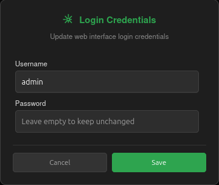
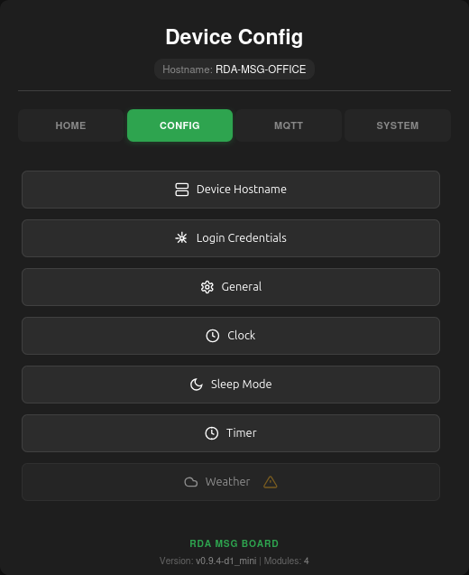
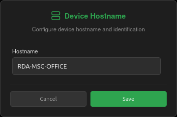
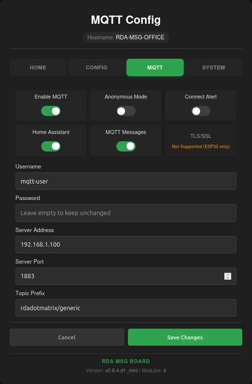
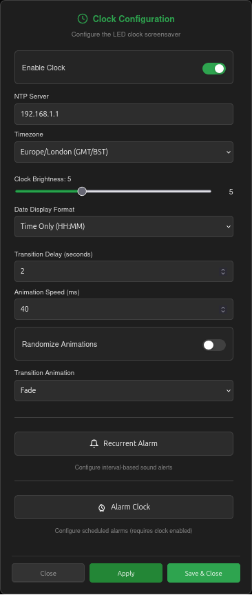
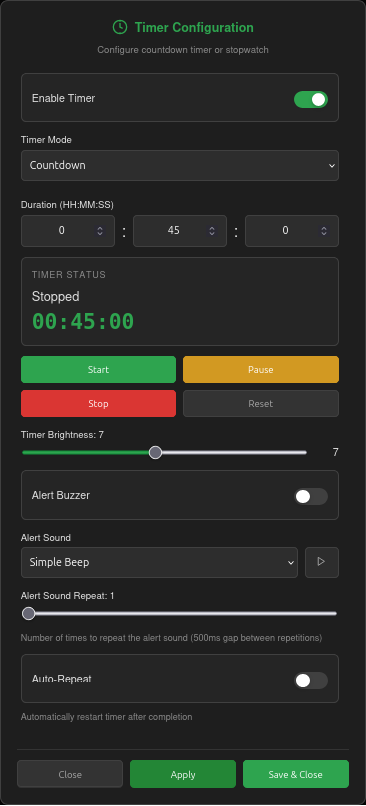
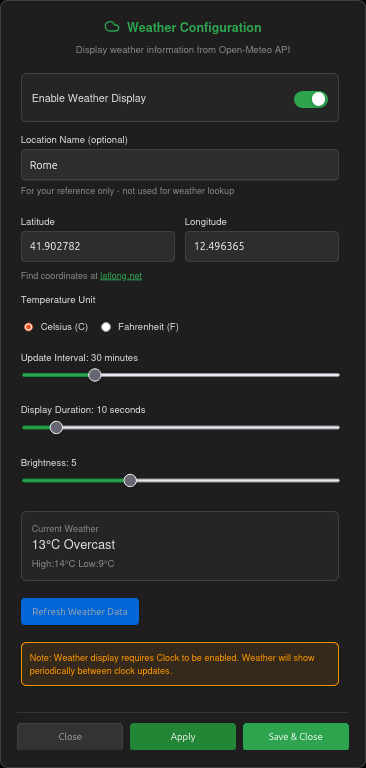
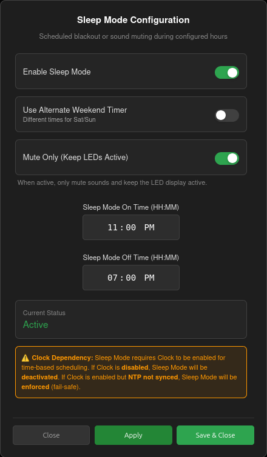
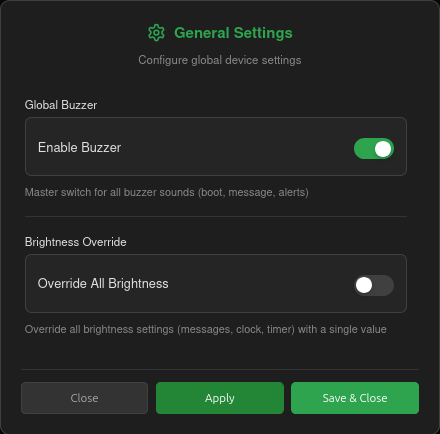
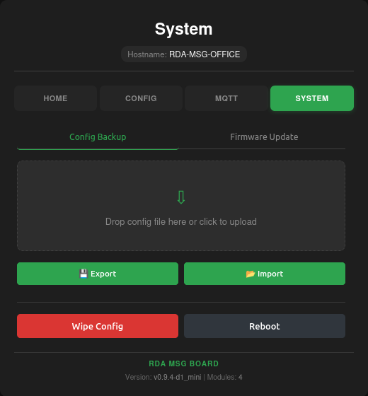

# Web Interface Overview

The RDA MSG Board features a comprehensive, responsive web interface that allows complete control over the device and its configuration. This guide provides a visual tour of the available settings pages.

## Main Message Interface
The main landing page provides instant control over the LED matrix. You can send messages, trigger alert sounds, change scroll speed, and set the brightness level.

## Authentication
To access the device configuration pages, basic HTTP authentication is required.

## Device Configuration
The device configuration page allows you to manage the device's core networking credentials and backup its settings.

### Custom Hostname
You can easily set a custom mDNS hostname (e.g., `livingroom-display.local`) from the Device Config page.

## MQTT Configuration
The MQTT settings allow integration with Home Assistant and other smart home platforms via an MQTT broker.

## Clock & Display Settings
Configure a standalone digital clock, customize the timezone, and choose transition animations (e.g., Wipe, Fade, Scroll).

## Timer & Stopwatch
A precision millisecond timer and stopwatch feature, complete with audible alerts.

## Weather / OpenWeatherMap (ESP32 Only)
Integrate OpenWeatherMap to display current conditions and forecasts alongside your messages and clock. This feature is only available on the ESP32 firmware.

## Sleep Mode Scheduling
Save power or eliminate light pollution at night by scheduling specific display blackout windows.

## General Overrides
Control global limits, such as muting all buzzers or hard-setting the brightness override level.

## System Management (OTA & Reset)
Perform Over-The-Air (OTA) firmware updates, reboot the device, or factory wipe it from the System page.

